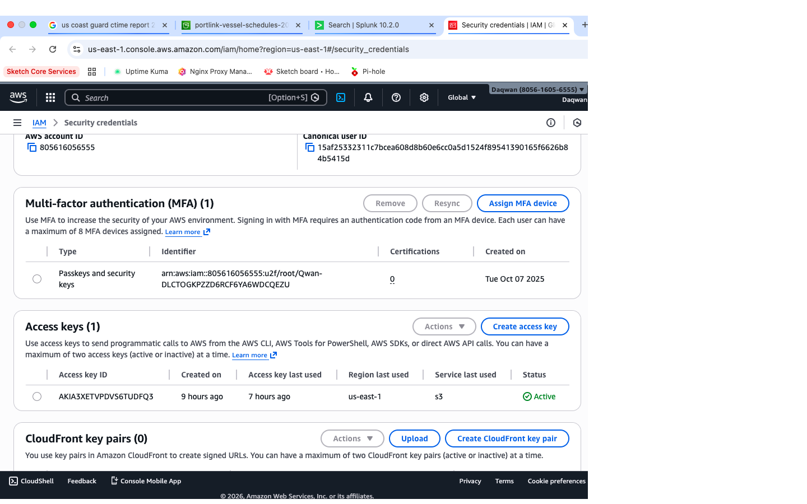
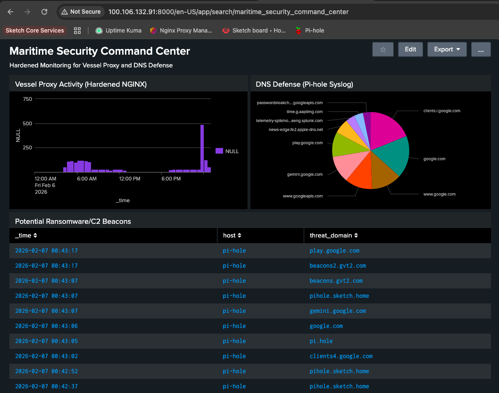
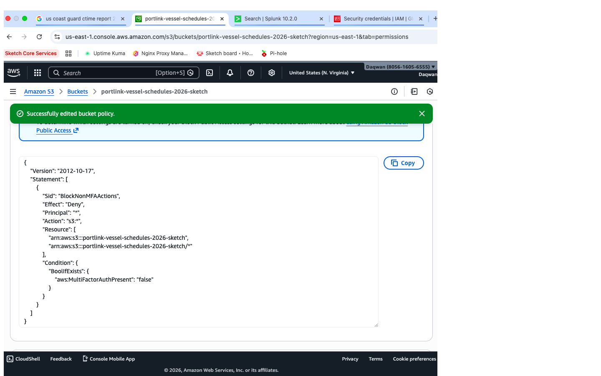
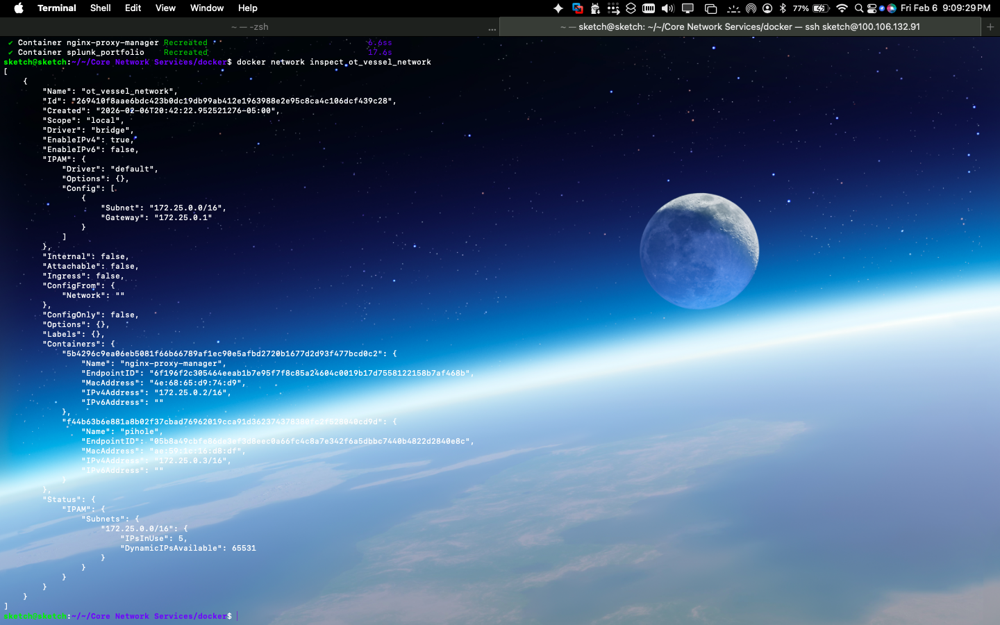

# Maritime-Cybersecurity-Framework

🛡️ Draft: README.md
Maritime Cloud Security & Continuous Monitoring Framework
Candidate: Daqwan H. (CySO Applicant)
Objective: Implementation of hardened cloud infrastructure and real-time threat monitoring for maritime environments in accordance with the USCG 2025 Maritime Cybersecurity Rule.
📑 Project Overview
This repository documents the engineering and deployment of a secure maritime data environment. Following the 2025 CTIME Report (4th Edition), which identifies ships as "extensions of corporate networks," this project implements Zero-Trust identity management and integrated IT/OT logging.
🛠️ Technical Implementation
1. Identity & Access Governance (MFA)
2. 
* Control: Root account hardening via Passkey/U2F (Qwan-DLCT...).
* Compliance: Mitigates the widespread use of identical passwords and plaintext credentials identified by CGCYBER.
* Status: [VERIFIED] Hardware-backed MFA active since Oct 07, 2025.
2. S3 Data Lockdown & Policy Enforcement
  
* Public Access: Global Block all public access enabled for vessel manifests.
* Condition-Based Access: Authored a mandatory JSON Bucket Policy denying all actions if MFA is not present (aws:MultiFactorAuthPresent: false).
* Evidence: Active monitoring of AKIA3... access keys confirms secure programmatic calls.
3. Splunk: Maritime Security Command Center
  
 
* Pipeline: Integrated 11,456 Proxy events (NGINX) and 5,841 DNS events (Pi-hole).
* Threat Hunting: Real-time extraction of Command & Control (C2) Beacons from syslog data, tracking high-risk domains such as beacons2.gvt2.com.
   
* Operational OT Security: Visualizes "blurring IT/OT systems" through a unified Classic Dashboard.
🚢 Regulatory Alignment: CTIME 2025
  
* Breaking the Air-Gap: Recognizes that constant satellite connectivity requires persistent oversight.
* Continuous Monitoring: Fulfills the July 2025 mandate for owners to establish persistent system visibility.
* Incident Response: Ready for GPS spoofing and ransomware detection via telemetry analysis.
  
📊 Portfolio Evidence Summary
Domain	Control	Evidence
Identity	MFA Passkey	IAM Credentials
Data	MFA Enforcement Policy	S3 Bucket Policy
Visibility	Unified Log Pipeline	Maritime Dashboard
💡 Tips for your GitHub
